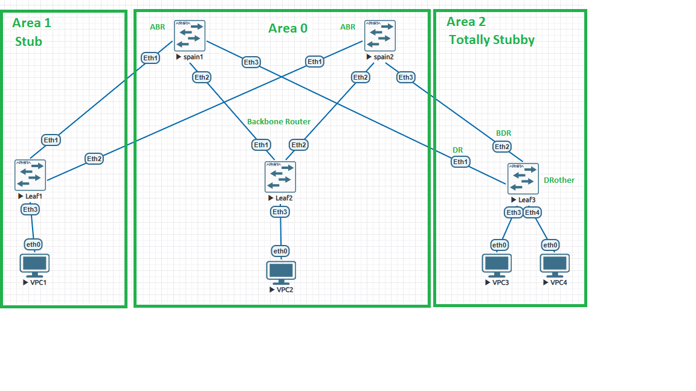

# Конфигурация OSPF для Clos-топологии (Spine-and-Leaf)


> Рабочая документация: адресный план, конфигурация OSPF, состояния соседей и таблицы маршрутизации.

В данном проекте реализована многозонная топология OSPF со следующими параметрами:
* **Area 0 (Backbone)**: Транзитная зона через Leaf2 для связи Spine-коммутаторов.
* **Area 1 (Stub)**: Тупиковая зона для изоляции Leaf1 от внешних маршрутов.
* **Area 2 (Totally Stubby)**: Полностью тупиковая зона для Leaf3 (блокируются Type 3 и Type 5 LSA).
* **DR/BDR сегмент**: Настроен в Area 2 (Spine1 — DR, Spine2 — BDR, Leaf3 — DRother).

---

## 1. IP-план

### 1.1. Loopback-адреса

| Устройство | Loopback0 | OSPF Area | Назначение |
|---|---|---:|---|
| Spine1 | `1.1.1.1/32` | 0 | Router-ID / Loopback |
| Spine2 | `2.2.2.2/32` | 0 | Router-ID / Loopback |
| Leaf1 | `11.11.11.11/32` | 1 | Router-ID / Loopback |
| Leaf2 | `22.22.22.22/32` | 0 | Router-ID / Loopback |
| Leaf3 | `33.33.33.33/32` | 2 | Router-ID / Loopback |

### 1.2. Транзитные OSPF-сети

| Сеть | Устройство | Интерфейс | IP-адрес | Area | Назначение |
|---|---|---|---|---:|---|
| `10.10.1.0/30` | Spine1 | Ethernet1 | `10.10.1.1/30` | 1 | Spine1 ↔ Leaf1 |
| `10.10.1.0/30` | Leaf1 | Ethernet1 | `10.10.1.2/30` | 1 | Spine1 ↔ Leaf1 |
| `10.10.1.4/30` | Spine2 | Ethernet1 | `10.10.1.5/30` | 1 | Spine2 ↔ Leaf1 |
| `10.10.1.4/30` | Leaf1 | Ethernet2 | `10.10.1.6/30` | 1 | Spine2 ↔ Leaf1 |
| `10.10.0.0/30` | Spine1 | Ethernet2 | `10.10.0.1/30` | 0 | Spine1 ↔ Leaf2 |
| `10.10.0.0/30` | Leaf2 | Ethernet1 | `10.10.0.2/30` | 0 | Spine1 ↔ Leaf2 |
| `10.10.0.4/30` | Spine2 | Ethernet2 | `10.10.0.5/30` | 0 | Spine2 ↔ Leaf2 |
| `10.10.0.4/30` | Leaf2 | Ethernet2 | `10.10.0.6/30` | 0 | Spine2 ↔ Leaf2 |
| `10.10.2.0/30` | Spine1 | Ethernet3 | `10.10.2.1/30` | 2 | Spine1 ↔ Leaf3 |
| `10.10.2.0/30` | Leaf3 | Ethernet1 | `10.10.2.2/30` | 2 | Spine1 ↔ Leaf3 |
| `10.10.2.4/30` | Spine2 | Ethernet3 | `10.10.2.5/30` | 2 | Spine2 ↔ Leaf3 |
| `10.10.2.4/30` | Leaf3 | Ethernet2 | `10.10.2.6/30` | 2 | Spine2 ↔ Leaf3 |

### 1.3. Пользовательские сети

| Сеть | Шлюз | Конечное устройство | IP | Area | Назначение |
|---|---|---|---|---:|---|
| `192.168.1.0/24` | `192.168.1.1` | VPC1 | `192.168.1.10/24` | 1 | LAN Leaf1 |
| `192.168.2.0/24` | `192.168.2.1` | VPC2 | `192.168.2.10/24` | 0 | LAN Leaf2 |
| `192.168.3.0/24` | `192.168.3.1` | VPC3 | `192.168.3.10/24` | 2 | LAN Leaf3 |
| `192.168.4.0/24` | `192.168.4.1` | VPC4 | `192.168.4.10/24` | 2 | LAN Leaf3 |

### 1.4. Сводка адресного плана

- **Loopback:** `1.1.1.1/32`, `2.2.2.2/32`, `11.11.11.11/32`, `22.22.22.22/32`, `33.33.33.33/32`.
- **Транзит Spine–Leaf:** `10.10.0.0/30`, `10.10.0.4/30`, `10.10.1.0/30`, `10.10.1.4/30`, `10.10.2.0/30`, `10.10.2.4/30`.
- **Пользовательские сети:** `192.168.1.0/24`–`192.168.4.0/24`.
- Все транзитные соединения используют `/30`, что дает по два рабочих адреса на линк.
- Area 0 используется для Backbone, Area 1 — для Leaf1, Area 2 — для Leaf3.

---

## 2. Конфигурация Spine-коммутаторов (ABR)

### Spine1
```text
ip routing
router ospf 1
   router-id 1.1.1.1
   area 1 stub
   area 2 stub no-summary
!
interface Loopback0
   ip address 1.1.1.1/32
   ip ospf area 0
!
interface Ethernet1
   description LINK_TO_LEAF1
   ip address 10.10.1.1/30
   ip ospf area 1
!
interface Ethernet2
   description LINK_TO_LEAF2
   ip address 10.10.0.1/30
   ip ospf area 0
!
interface Ethernet3
   description LINK_TO_LEAF3
   ip address 10.10.2.1/30
   ip ospf area 2
   ip ospf network broadcast
   ip ospf priority 100
```

### Spine2
```text
ip routing
router ospf 1
   router-id 2.2.2.2
   area 1 stub
   area 2 stub no-summary
!
interface Loopback0
   ip address 2.2.2.2/32
   ip ospf area 0
!
interface Ethernet1
   description LINK_TO_LEAF1
   ip address 10.10.1.5/30
   ip ospf area 1
!
interface Ethernet2
   description LINK_TO_LEAF2
   ip address 10.10.0.5/30
   ip ospf area 0
!
interface Ethernet3
   description LINK_TO_LEAF3
   ip address 10.10.2.5/30
   ip ospf area 2
   ip ospf network broadcast
   ip ospf priority 50
```

---

## 3. Конфигурация Leaf-коммутаторов

### Leaf1 (Area 1 — Stub)
```text
ip routing
router ospf 1
   router-id 11.11.11.11
   area 1 stub
!
interface Loopback0
   ip address 11.11.11.11/32
   ip ospf area 1
!
interface Ethernet1
   description LINK_TO_SPINE1
   ip address 10.10.1.2/30
   ip ospf area 1
!
interface Ethernet2
   description LINK_TO_SPINE2
   ip address 10.10.1.6/30
   ip ospf area 1
!
interface Ethernet3
   description TO_VPC1
   ip address 192.168.1.1/24
   ip ospf area 1
```

### Leaf2 (Area 0 — Backbone)
```text
ip routing
router ospf 1
   router-id 22.22.22.22
!
interface Loopback0
   ip address 22.22.22.22/32
   ip ospf area 0
!
interface Ethernet1
   description LINK_TO_SPINE1
   ip address 10.10.0.2/30
   ip ospf area 0
!
interface Ethernet2
   description LINK_TO_SPINE2
   ip address 10.10.0.6/30
   ip ospf area 0
!
interface Ethernet3
   description TO_VPC2
   ip address 192.168.2.1/24
   ip ospf area 0
```

### Leaf3 (Area 2 — Totally Stubby)
```text
ip routing
router ospf 1
   router-id 33.33.33.33
   area 2 stub
!
interface Loopback0
   ip address 33.33.33.33/32
   ip ospf area 2
!
interface Ethernet1
   description LINK_TO_SPINE1
   ip address 10.10.2.2/30
   ip ospf area 2
   ip ospf network broadcast
!
interface Ethernet2
   description LINK_TO_SPINE2
   ip address 10.10.2.6/30
   ip ospf area 2
   ip ospf network broadcast
!
interface Ethernet3
   description TO_VPC3
   ip address 192.168.3.1/24
   ip ospf area 2
!
interface Ethernet4
   description TO_VPC4
   ip address 192.168.4.1/24
   ip ospf area 2
```

---

## 4. Настройка конечных устройств (VPC)

* **VPC1**: IP `192.168.1.10/24`, Gateway `192.168.1.1`
* **VPC2**: IP `192.168.2.10/24`, Gateway `192.168.2.1`
* **VPC3**: IP `192.168.3.10/24`, Gateway `192.168.3.1`
* **VPC4**: IP `192.168.4.10/24`, Gateway `192.168.4.1`

## 5. Проверка работы OSPF на коммутаторах

### Spine1
	```
	localhost(config-if-Et1)#show ip ospf neighbor
	Neighbor ID     Instance VRF      Pri State                  Dead Time   Address         Interface
	22.22.22.22     1        default  1   FULL/BDR               00:00:29    10.10.0.2       Ethernet2
	11.11.11.11     1        default  1   FULL/BDR               00:00:33    10.10.1.2       Ethernet1
	33.33.33.33     1        default  1   FULL/BDR               00:00:31    10.10.2.2       Ethernet3
	```
	```
	localhost(config-if-Et1)#show running-config section ospf
	interface Ethernet1
	   ip ospf area 0.0.0.1
	interface Ethernet2
	   ip ospf area 0.0.0.0
	interface Ethernet3
	   ip ospf priority 100
	   ip ospf area 0.0.0.2
	interface Loopback0
	   ip ospf area 0.0.0.0
	router ospf 1
	   router-id 1.1.1.1
	   area 0.0.0.1 stub
	   area 0.0.0.2 stub no-summary
	   max-lsa 12000
	```   
	```   
	localhost(config-if-Et1)#show ip ospf database

				OSPF Router with ID(1.1.1.1) (Instance ID 1) (VRF default)


					 Router Link States (Area 0.0.0.0)

	Link ID         ADV Router      Age         Seq#         Checksum Link count
	22.22.22.22     22.22.22.22     1043        0x80000006   0x39ca   4
	2.2.2.2         2.2.2.2         1040        0x80000005   0x2c93   2
	1.1.1.1         1.1.1.1         1139        0x8000000d   0x6f5d   2

					 Network Link States (Area 0.0.0.0)

	Link ID         ADV Router      Age         Seq#         Checksum
	10.10.0.6       22.22.22.22     1043        0x80000003   0xf59
	10.10.0.1       1.1.1.1         1139        0x80000003   0xd8ec

					 Summary Link States (Area 0.0.0.0)

	Link ID         ADV Router      Age         Seq#         Checksum
	11.11.11.11     1.1.1.1         179         0x8000000c   0x22cb
	192.168.1.0     1.1.1.1         179         0x8000000c   0x614e
	192.168.4.0     2.2.2.2         1640        0x80000002   0x367c
	192.168.4.0     1.1.1.1         1619        0x80000002   0x5462
	192.168.3.0     2.2.2.2         1640        0x80000002   0x4172
	192.168.1.0     2.2.2.2         1040        0x80000003   0x555f
	192.168.3.0     1.1.1.1         1619        0x80000002   0x5f58
	10.10.1.0       1.1.1.1         719         0x8000000c   0xa170
	10.10.2.4       2.2.2.2         1040        0x80000003   0x62af
	10.10.2.0       2.2.2.2         1640        0x80000002   0xf01c
	10.10.2.0       1.1.1.1         719         0x8000000c   0x967a
	10.10.2.4       1.1.1.1         1619        0x80000002   0xe626
	10.10.1.4       1.1.1.1         179         0x8000000c   0xdd26
	10.10.1.0       2.2.2.2         1040        0x80000003   0xf913
	10.10.1.4       2.2.2.2         1040        0x80000003   0x6da5
	33.33.33.33     2.2.2.2         1640        0x80000002   0x207b
	33.33.33.33     1.1.1.1         1619        0x80000002   0x3e61
	11.11.11.11     2.2.2.2         1040        0x80000003   0x16dc

					 Router Link States (Area 0.0.0.1)

	Link ID         ADV Router      Age         Seq#         Checksum Link count
	2.2.2.2         2.2.2.2         1040        0x80000005   0x25bc   1
	11.11.11.11     11.11.11.11     1033        0x8000000e   0xd6a8   4
	1.1.1.1         1.1.1.1         239         0x8000000e   0xf4f4   1

					 Network Link States (Area 0.0.0.1)

	Link ID         ADV Router      Age         Seq#         Checksum
	10.10.1.6       11.11.11.11     1033        0x80000003   0xf5cb
	10.10.1.1       1.1.1.1         239         0x8000000c   0xb138

					 Summary Link States (Area 0.0.0.1)

	Link ID         ADV Router      Age         Seq#         Checksum
	1.1.1.1         1.1.1.1         719         0x8000000c   0xa978
	10.10.0.0       1.1.1.1         719         0x8000000c   0xca4a
	192.168.2.0     1.1.1.1         1139        0x80000003   0x8633
	0.0.0.0         2.2.2.2         1040        0x80000003   0xcb5f
	0.0.0.0         1.1.1.1         719         0x8000000c   0xd74e
	192.168.3.0     2.2.2.2         1640        0x80000002   0x5f56
	192.168.4.0     2.2.2.2         1640        0x80000002   0x5460
	192.168.4.0     1.1.1.1         1619        0x80000002   0x7246
	192.168.2.0     2.2.2.2         1040        0x80000003   0x684d
	192.168.3.0     1.1.1.1         1619        0x80000002   0x7d3c
	22.22.22.22     1.1.1.1         1139        0x80000003   0x5676
	2.2.2.2         1.1.1.1         1019        0x80000003   0x56bc
	2.2.2.2         2.2.2.2         1040        0x80000003   0x6fb3
	10.10.2.0       1.1.1.1         719         0x8000000c   0xb45e
	10.10.0.4       1.1.1.1         1139        0x80000003   0x19f6
	10.10.0.0       2.2.2.2         1040        0x80000003   0x23ec
	10.10.0.4       2.2.2.2         1040        0x80000003   0x967f
	10.10.2.4       1.1.1.1         1619        0x80000003   0x30b
	10.10.2.0       2.2.2.2         1640        0x80000003   0xd01
	10.10.2.4       2.2.2.2         1040        0x80000003   0x8093
	22.22.22.22     2.2.2.2         1040        0x80000003   0x3890
	33.33.33.33     2.2.2.2         1640        0x80000002   0x3e5f
	1.1.1.1         2.2.2.2         1040        0x80000003   0x66ac
	33.33.33.33     1.1.1.1         1619        0x80000002   0x5c45

					 Router Link States (Area 0.0.0.2)

	Link ID         ADV Router      Age         Seq#         Checksum Link count
	2.2.2.2         2.2.2.2         1640        0x80000004   0x33ae   1
	33.33.33.33     33.33.33.33     1639        0x80000006   0x45ac   5
	1.1.1.1         1.1.1.1         1619        0x8000000d   0xddb    1

					 Network Link States (Area 0.0.0.2)

	Link ID         ADV Router      Age         Seq#         Checksum
	10.10.2.1       1.1.1.1         1619        0x80000002   0xb8f
	10.10.2.5       2.2.2.2         1640        0x80000002   0xe6a7

					 Summary Link States (Area 0.0.0.2)

	Link ID         ADV Router      Age         Seq#         Checksum
	0.0.0.0         2.2.2.2         1040        0x80000003   0xcb5f
	0.0.0.0         1.1.1.1         719         0x8000000c   0xd74e
	```
	```
	localhost(config-if-Et1)#show ip route ospf
	VRF: default
	Source Codes:
		   C - connected, S - static, K - kernel,
		   O - OSPF, O IA - OSPF inter area, O E1 - OSPF external type 1,
		   O E2 - OSPF external type 2, O N1 - OSPF NSSA external type 1,
		   O N2 - OSPF NSSA external type2, O3 - OSPFv3,
		   O3 IA - OSPFv3 inter area, O3 E1 - OSPFv3 external type 1,
		   O3 E2 - OSPFv3 external type 2,
		   O3 N1 - OSPFv3 NSSA external type 1,
		   O3 N2 - OSPFv3 NSSA external type2, B - Other BGP Routes,
		   B I - iBGP, B E - eBGP, R - RIP, I L1 - IS-IS level 1,
		   I L2 - IS-IS level 2, A B - BGP Aggregate,
		   A O - OSPF Summary, NG - Nexthop Group Static Route,
		   V - VXLAN Control Service, M - Martian,
		   DH - DHCP client installed default route,
		   DP - Dynamic Policy Route, L - VRF Leaked,
		   G  - gRIBI, RC - Route Cache Route,
		   CL - CBF Leaked Route

	 O        2.2.2.2/32 [110/30]
			   via 10.10.0.2, Ethernet2
	 O        10.10.0.4/30 [110/20]
			   via 10.10.0.2, Ethernet2
	 O        10.10.1.4/30 [110/20]
			   via 10.10.1.2, Ethernet1
	 O        10.10.2.4/30 [110/20]
			   via 10.10.2.2, Ethernet3
	 O        11.11.11.11/32 [110/20]
			   via 10.10.1.2, Ethernet1
	 O        22.22.22.22/32 [110/20]
			   via 10.10.0.2, Ethernet2
	 O        33.33.33.33/32 [110/20]
			   via 10.10.2.2, Ethernet3
	 O        192.168.1.0/24 [110/20]
			   via 10.10.1.2, Ethernet1
	 O        192.168.2.0/24 [110/20]
			   via 10.10.0.2, Ethernet2
	 O        192.168.3.0/24 [110/20]
			   via 10.10.2.2, Ethernet3
	 O        192.168.4.0/24 [110/20]
			   via 10.10.2.2, Ethernet3
	```

### Spine2
	```
	localhost(config-if-Et3)#show ip ospf neighbor
	Neighbor ID     Instance VRF      Pri State                  Dead Time   Address         Interface
	22.22.22.22     1        default  1   FULL/DR                00:00:35    10.10.0.6       Ethernet2
	11.11.11.11     1        default  1   FULL/DR                00:00:38    10.10.1.6       Ethernet1
	33.33.33.33     1        default  1   FULL/BDR               00:00:38    10.10.2.6       Ethernet3
	```
	```
	localhost(config-if-Et3)#show running-config section osp
	interface Ethernet1
	   ip ospf area 0.0.0.1
	interface Ethernet2
	   ip ospf area 0.0.0.0
	interface Ethernet3
	   ip ospf priority 50
	   ip ospf area 0.0.0.2
	interface Loopback0
	   ip ospf area 0.0.0.0
	router ospf 1
	   router-id 2.2.2.2
	   area 0.0.0.1 stub
	   area 0.0.0.2 stub no-summary
	   max-lsa 12000
	```
	```
	localhost(config-if-Et3)#show ip ospf database

				OSPF Router with ID(2.2.2.2) (Instance ID 1) (VRF default)


					 Router Link States (Area 0.0.0.0)

	Link ID         ADV Router      Age         Seq#         Checksum Link count
	1.1.1.1         1.1.1.1         624         0x8000005f   0xcaaf   2
	22.22.22.22     22.22.22.22     526         0x80000058   0x941d   4
	2.2.2.2         2.2.2.2         521         0x80000057   0x87e5   2

					 Network Link States (Area 0.0.0.0)

	Link ID         ADV Router      Age         Seq#         Checksum
	10.10.0.6       22.22.22.22     526         0x80000055   0x6aab
	10.10.0.1       1.1.1.1         624         0x80000055   0x343f

					 Summary Link States (Area 0.0.0.0)

	Link ID         ADV Router      Age         Seq#         Checksum
	11.11.11.11     1.1.1.1         1524        0x8000005d   0x7f1d
	192.168.1.0     1.1.1.1         1524        0x8000005d   0xbe9f
	192.168.4.0     2.2.2.2         1121        0x80000054   0x91ce
	192.168.4.0     1.1.1.1         1104        0x80000054   0xafb4
	192.168.3.0     2.2.2.2         1121        0x80000054   0x9cc4
	192.168.1.0     2.2.2.2         521         0x80000055   0xb0b1
	192.168.3.0     1.1.1.1         1104        0x80000054   0xbaaa
	10.10.1.4       2.2.2.2         521         0x80000055   0xc8f7
	10.10.2.0       1.1.1.1         204         0x8000005e   0xf1cc
	10.10.2.0       2.2.2.2         1121        0x80000054   0x4c6e
	10.10.2.4       1.1.1.1         1104        0x80000054   0x4278
	10.10.2.4       2.2.2.2         521         0x80000055   0xbd02
	10.10.1.0       1.1.1.1         204         0x8000005e   0xfcc2
	10.10.1.0       2.2.2.2         521         0x80000055   0x5565
	10.10.1.4       1.1.1.1         1524        0x8000005d   0x3b77
	33.33.33.33     2.2.2.2         1121        0x80000054   0x7bcd
	33.33.33.33     1.1.1.1         1104        0x80000054   0x99b3
	11.11.11.11     2.2.2.2         521         0x80000055   0x712f

					 Router Link States (Area 0.0.0.1)

	Link ID         ADV Router      Age         Seq#         Checksum Link count
	11.11.11.11     11.11.11.11     516         0x80000060   0x32fa   4
	2.2.2.2         2.2.2.2         521         0x80000057   0x800f   1
	1.1.1.1         1.1.1.1         1584        0x8000005f   0x5246   1

					 Network Link States (Area 0.0.0.1)

	Link ID         ADV Router      Age         Seq#         Checksum
	10.10.1.6       11.11.11.11     516         0x80000055   0x511e
	10.10.1.1       1.1.1.1         1584        0x8000005d   0xf89

					 Summary Link States (Area 0.0.0.1)

	Link ID         ADV Router      Age         Seq#         Checksum
	1.1.1.1         1.1.1.1         204         0x8000005e   0x5ca
	2.2.2.2         2.2.2.2         521         0x80000055   0xca06
	192.168.2.0     1.1.1.1         624         0x80000055   0xe185
	0.0.0.0         1.1.1.1         204         0x8000005e   0x33a0
	0.0.0.0         2.2.2.2         521         0x80000055   0x27b1
	192.168.3.0     2.2.2.2         1121        0x80000054   0xbaa8
	192.168.4.0     2.2.2.2         1121        0x80000054   0xafb2
	192.168.4.0     1.1.1.1         1104        0x80000054   0xcd98
	192.168.2.0     2.2.2.2         521         0x80000055   0xc39f
	192.168.3.0     1.1.1.1         1104        0x80000054   0xd88e
	22.22.22.22     1.1.1.1         624         0x80000055   0xb1c8
	10.10.0.4       2.2.2.2         521         0x80000055   0xf1d1
	2.2.2.2         1.1.1.1         504         0x80000055   0xb10f
	10.10.2.4       2.2.2.2         521         0x80000055   0xdbe5
	10.10.0.0       1.1.1.1         204         0x8000005e   0x269c
	10.10.0.0       2.2.2.2         521         0x80000055   0x7e3f
	10.10.0.4       1.1.1.1         624         0x80000055   0x7449
	10.10.2.0       1.1.1.1         204         0x8000005e   0x10b0
	10.10.2.0       2.2.2.2         1121        0x80000055   0x6853
	10.10.2.4       1.1.1.1         1104        0x80000055   0x5e5d
	22.22.22.22     2.2.2.2         521         0x80000055   0x93e2
	33.33.33.33     2.2.2.2         1121        0x80000054   0x99b1
	1.1.1.1         2.2.2.2         521         0x80000055   0xc1fe
	33.33.33.33     1.1.1.1         1104        0x80000054   0xb797

					 Router Link States (Area 0.0.0.2)

	Link ID         ADV Router      Age         Seq#         Checksum Link count
	33.33.33.33     33.33.33.33     1122        0x80000058   0xa0fe   5
	2.2.2.2         2.2.2.2         1121        0x80000056   0x8e01   1
	1.1.1.1         1.1.1.1         1104        0x8000005f   0x682e   1

					 Network Link States (Area 0.0.0.2)

	Link ID         ADV Router      Age         Seq#         Checksum
	10.10.2.1       1.1.1.1         1104        0x80000054   0x66e1
	10.10.2.5       2.2.2.2         1121        0x80000054   0x42f9

					 Summary Link States (Area 0.0.0.2)

	Link ID         ADV Router      Age         Seq#         Checksum
	0.0.0.0         1.1.1.1         204         0x8000005e   0x33a0
	0.0.0.0         2.2.2.2         521         0x80000055   0x27b1
	```
	```
	localhost#show ip route ospf

	VRF: default
	Source Codes:
		   C - connected, S - static, K - kernel,
		   O - OSPF, O IA - OSPF inter area, O E1 - OSPF external type 1,
		   O E2 - OSPF external type 2, O N1 - OSPF NSSA external type 1,
		   O N2 - OSPF NSSA external type2, O3 - OSPFv3,
		   O3 IA - OSPFv3 inter area, O3 E1 - OSPFv3 external type 1,
		   O3 E2 - OSPFv3 external type 2,
		   O3 N1 - OSPFv3 NSSA external type 1,
		   O3 N2 - OSPFv3 NSSA external type2, B - Other BGP Routes,
		   B I - iBGP, B E - eBGP, R - RIP, I L1 - IS-IS level 1,
		   I L2 - IS-IS level 2, A B - BGP Aggregate,
		   A O - OSPF Summary, NG - Nexthop Group Static Route,
		   V - VXLAN Control Service, M - Martian,
		   DH - DHCP client installed default route,
		   DP - Dynamic Policy Route, L - VRF Leaked,
		   G  - gRIBI, RC - Route Cache Route,
		   CL - CBF Leaked Route

	 O        1.1.1.1/32 [110/30]
			   via 10.10.0.6, Ethernet2
	 O        10.10.0.0/30 [110/20]
			   via 10.10.0.6, Ethernet2
	 O        10.10.1.0/30 [110/20]
			   via 10.10.1.6, Ethernet1
	 O        10.10.2.0/30 [110/20]
			   via 10.10.2.6, Ethernet3
	 O        11.11.11.11/32 [110/20]
			   via 10.10.1.6, Ethernet1
	 O        22.22.22.22/32 [110/20]
			   via 10.10.0.6, Ethernet2
	 O        33.33.33.33/32 [110/20]
			   via 10.10.2.6, Ethernet3
	 O        192.168.1.0/24 [110/20]
			   via 10.10.1.6, Ethernet1
	 O        192.168.2.0/24 [110/20]
			   via 10.10.0.6, Ethernet2
	 O        192.168.3.0/24 [110/20]
			   via 10.10.2.6, Ethernet3
	 O        192.168.4.0/24 [110/20]
			   via 10.10.2.6, Ethernet3
	```

### Leaf1
	```
	localhost(config)#show ip ospf neighbor
	Neighbor ID     Instance VRF      Pri State                  Dead Time   Address         Interface
	1.1.1.1         1        default  1   FULL/DR                00:00:34    10.10.1.1       Ethernet1
	2.2.2.2         1        default  1   FULL/BDR               00:00:33    10.10.1.5       Ethernet2
	```
	```
	localhost(config)#show running-config section osp
	interface Ethernet1
	   ip ospf area 0.0.0.1
	interface Ethernet2
	   ip ospf area 0.0.0.1
	interface Ethernet3
	   ip ospf area 0.0.0.1
	interface Loopback0
	   ip ospf area 0.0.0.1
	router ospf 1
	   router-id 11.11.11.11
	   area 0.0.0.1 stub
	   max-lsa 12000
	```
### Leaf2
	```
	localhost#show ip ospf neighbor
	Neighbor ID     Instance VRF      Pri State                  Dead Time   Address         Interface
	2.2.2.2         1        default  1   FULL/BDR               00:00:30    10.10.0.5       Ethernet2
	1.1.1.1         1        default  1   FULL/DR                00:00:29    10.10.0.1       Ethernet1
	```
	```
	localhost#show running-config section osp
	interface Ethernet1
	   ip ospf area 0.0.0.0
	interface Ethernet2
	   ip ospf area 0.0.0.0
	interface Ethernet3
	   ip ospf area 0.0.0.0
	interface Loopback0
	   ip ospf area 0.0.0.0
	router ospf 1
	   router-id 22.22.22.22
	   max-lsa 12000
	```
### Leaf3
	```
	localhost#show ip ospf neighbor
	Neighbor ID     Instance VRF      Pri State                  Dead Time   Address         Interface
	2.2.2.2         1        default  50  FULL/DR                00:00:33    10.10.2.5       Ethernet2
	1.1.1.1         1        default  100 FULL/DR                00:00:38    10.10.2.1       Ethernet1
	```
	```
	localhost#show running-config section osp
	interface Ethernet1
	   ip ospf area 0.0.0.2
	interface Ethernet2
	   ip ospf area 0.0.0.2
	interface Ethernet3
	   ip ospf area 0.0.0.2
	interface Ethernet4
	   ip ospf area 0.0.0.2
	interface Loopback0
	   ip ospf area 0.0.0.2
	router ospf 1
	   router-id 33.33.33.33
	   area 0.0.0.2 stub
	   max-lsa 12000
	```