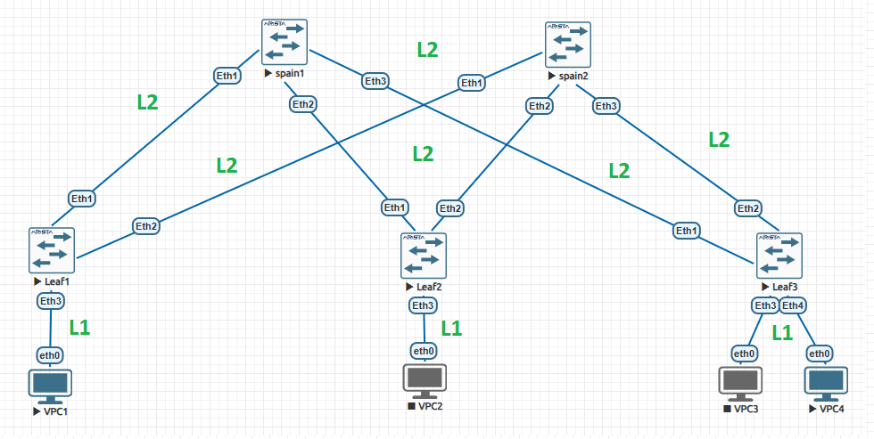

# Лабораторная работа: Построение Underlay-сети на базе Multi-Level IS-IS в топологии Clos

---

## 1. Архитектура сети.

* **Иерархический IS-IS (Multi-Level)**:
  * Уровень **Spine (Core)** выполняет роль магистрали фабрики и переведен в режим **Level 2**. Оба Spine находятся в единой backbone-зоне `49.0002`.
  * Уровень **Leaf (Access)** отвечает за подключение клиентов. Каждый Leaf изолирован в своей уникальной зоне **Level 1** (`49.0011`, `49.0012`, `49.0013`). 
  * Все линки между Spine и Leaf настроены как **Point-to-Point (p2p)**.

---

## 2. Адресный план фабрики

### Loopback-интерфейсы

| Устройство | Роль IS-IS | IP (Loopback0) | IS-IS NET ID |
| :--- | :--- | :--- | :--- |
| **s1 (spain1)** | Level 2 (Only) | `10.0.0.1` | `49.0002.0100.0000.0001.00` |
| **s2 (spain2)** | Level 2 (Only) | `10.0.0.2` | `49.0002.0100.0000.0002.00` |
| **l1 (Leaf1)** | Level 1-2 | `10.0.0.11` | `49.0011.0100.0000.0011.00` |
| **l2 (Leaf2)** | Level 1-2 | `10.0.0.12` | `49.0012.0100.0000.0012.00` |
| **l3 (Leaf3)** | Level 1-2 | `10.0.0.13` | `49.0013.0100.0000.0013.00` |

### Инфраструктурные P2P-линки
Маска интерфейсов: `/31` (Point-to-Point).

| Линк (От -> Кому) | Локальный порт | Порт соседа | Подсеть линка | IP Локальный | IP Соседа |
| :--- | :--- | :--- | :--- | :--- | :--- |
| **s1 <-> l1** | Ethernet1 | Ethernet1 | `10.1.1.0/31` | `10.1.1.0` | `10.1.1.1` |
| **s1 <-> l2** | Ethernet2 | Ethernet1 | `10.1.1.2/31` | `10.1.1.2` | `10.1.1.3` |
| **s1 <-> l3** | Ethernet3 | Ethernet1 | `10.1.1.4/31` | `10.1.1.4` | `10.1.1.5` |
| **s2 <-> l1** | Ethernet1 | Ethernet2 | `10.1.1.6/31` | `10.1.1.6` | `10.1.1.7` |
| **s2 <-> l2** | Ethernet2 | Ethernet2 | `10.1.1.8/31` | `10.1.1.8` | `10.1.1.9` |
| **s2 <-> l3** | Ethernet3 | Ethernet2 | `10.1.1.10/31` | `10.1.1.10` | `10.1.1.11` |

### Клиентские сети (VPC)

| Коммутатор | Port | Клиент | Подсеть хоста | IP Шлюза (Leaf) | IP Хоста (VPC) |
| :--- | :--- | :--- | :--- | :--- | :--- |
| **l1 (Leaf1)** | Ethernet3 | **VPC1** | `192.168.11.0/24` | `192.168.11.1` | `192.168.11.10` |
| **l2 (Leaf2)** | Ethernet3 | **VPC2** | `192.168.12.0/24` | `192.168.12.1` | `192.168.12.10` |
| **l3 (Leaf3)** | Ethernet3 | **VPC3** | `192.168.13.0/24` | `192.168.13.1` | `192.168.13.10` |
| **l3 (Leaf3)** | Ethernet4 | **VPC4** | `192.168.14.0/24` | `192.168.14.1` | `192.168.14.10` |

---

## 3. Конфигурация оборудования (Arista EOS CLI)

### Spine 1 (s1)
```text
router isis Underlay
   net 49.0002.0100.0000.0001.00
   is-type level-2
   !
   address-family ipv4 unicast
   !
interface Loopback0
   ip address 10.0.0.1/32
   isis enable Underlay
   !
interface Ethernet1
   no switchport
   ip address 10.1.1.0/31
   isis enable Underlay
   isis network point-to-point
   !
interface Ethernet2
   no switchport
   ip address 10.1.1.2/31
   isis enable Underlay
   isis network point-to-point
   !
interface Ethernet3
   no switchport
   ip address 10.1.1.4/31
   isis enable Underlay
   isis network point-to-point
```

### Spine 2 (s2)
```text
router isis Underlay
   net 49.0002.0100.0000.0002.00
   is-type level-2
   !
   address-family ipv4 unicast
   !
interface Loopback0
   ip address 10.0.0.2/32
   isis enable Underlay
   !
interface Ethernet1
   no switchport
   ip address 10.1.1.6/31
   isis enable Underlay
   isis network point-to-point
   !
interface Ethernet2
   no switchport
   ip address 10.1.1.8/31
   isis enable Underlay
   isis network point-to-point
   !
interface Ethernet3
   no switchport
   ip address 10.1.1.10/31
   isis enable Underlay
   isis network point-to-point
```

### Leaf 1 (l1)
```text
router isis Underlay
   net 49.0011.0100.0000.0011.00
   is-type level-1-2
   !
   address-family ipv4 unicast
   !
interface Loopback0
   ip address 10.0.0.11/32
   isis enable Underlay
   !
interface Ethernet1
   no switchport
   ip address 10.1.1.1/31
   isis enable Underlay
   isis circuit-type level-2
   isis network point-to-point
   !
interface Ethernet2
   no switchport
   ip address 10.1.1.7/31
   isis enable Underlay
   isis circuit-type level-2
   isis network point-to-point
   !
interface Ethernet3
   no switchport
   ip address 192.168.11.1/24
   isis enable Underlay
   isis circuit-type level-1
```

### Leaf 2 (l2)
```text
router isis Underlay
   net 49.0012.0100.0000.0012.00
   is-type level-1-2
   !
   address-family ipv4 unicast
   !
interface Loopback0
   ip address 10.0.0.12/32
   isis enable Underlay
   !
interface Ethernet1
   no switchport
   ip address 10.1.1.3/31
   isis enable Underlay
   isis circuit-type level-2
   isis network point-to-point
   !
interface Ethernet2
   no switchport
   ip address 10.1.1.9/31
   isis enable Underlay
   isis circuit-type level-2
   isis network point-to-point
   !
interface Ethernet3
   no switchport
   ip address 192.168.12.1/24
   isis enable Underlay
   isis circuit-type level-1
```

### Leaf 3 (l3)
```text
router isis Underlay
   net 49.0013.0100.0000.0013.00
   is-type level-1-2
   !
   address-family ipv4 unicast
   !
interface Loopback0
   ip address 10.0.0.13/32
   isis enable Underlay
   !
interface Ethernet1
   no switchport
   ip address 10.1.1.5/31
   isis enable Underlay
   isis circuit-type level-2
   isis network point-to-point
   !
interface Ethernet2
   no switchport
   ip address 10.1.1.11/31
   isis enable Underlay
   isis circuit-type level-2
   isis network point-to-point
   !
interface Ethernet3
   no switchport
   ip address 192.168.13.1/24
   isis enable Underlay
   isis circuit-type level-1
   !
interface Ethernet4
   no switchport
   ip address 192.168.14.1/24
   isis enable Underlay
   isis circuit-type level-1
```

---

## 4. Верификация состояния соседства IS-IS (Штатный режим)

Выводы команды `show isis neighbors`

### Магистральный уровень (Spine Neighbors)
**Вывод на s1:**
```text
localhost(config-if-Et3)#show isis neighbors

Instance  VRF      System Id        Type Interface          SNPA              State Hold time   Circuit Id   
Underlay  default  0100.0000.0011   L2   Ethernet1          P2P               UP    27          1C           
Underlay  default  0100.0000.0012   L2   Ethernet2          P2P               UP    21          1E           
Underlay  default  0100.0000.0013   L2   Ethernet3          P2P               UP    27          15           
```

**Вывод на s2:**
```text
localhost(config-router-isis)#show isis neighbors

Instance  VRF      System Id        Type Interface          SNPA              State Hold time   Circuit Id      
Underlay  default  0100.0000.0011   L2   Ethernet1          P2P               UP    24          1E              
Underlay  default  0100.0000.0012   L2   Ethernet2          P2P               UP    21          1B              
Underlay  default  0100.0000.0013   L2   Ethernet3          P2P               UP    28          14              
```

### Уровень доступа (Leaf Neighbors)
**Вывод на l1:**
```text
localhost(config-if-Et2)#show isis neighbors

Instance  VRF      System Id        Type Interface          SNPA              State Hold time   Circuit Id
Underlay  default  0100.0000.0001   L2   Ethernet1          P2P               UP    22          14    
Underlay  default  0100.0000.0002   L2   Ethernet2          P2P               UP    27          11    
```
**Вывод на l2:**
```text
localhost(config-if-Et3)#show isis neighbors

Instance  VRF      System Id        Type Interface          SNPA              State Hold time   Circuit Id
Underlay  default  0100.0000.0001   L2   Ethernet1          P2P               UP    24          10
Underlay  default  0100.0000.0002   L2   Ethernet2          P2P               UP    23          15
```

**Вывод на l3:**
```text
localhost(config-if-Et4)#show isis neighbors

Instance  VRF      System Id        Type Interface          SNPA              State Hold time   Circuit Id
Underlay  default  0100.0000.0001   L2   Ethernet1          P2P               UP    28          11
Underlay  default  0100.0000.0002   L2   Ethernet2          P2P               UP    28          17
```
---

## 5. Проверка таблица маршрутизации и сквозной связности

### Шаг А. Итоговая таблица маршрутизации на Spine 1 (s1)

```text
show ip route
Gateway of last resort is not set

 C        10.0.0.1/32
           directly connected, Loopback0
 I L2     10.0.0.2/32 [115/30]
           via 10.1.1.1, Ethernet1
           via 10.1.1.3, Ethernet2
           via 10.1.1.5, Ethernet3
 I L2     10.0.0.11/32 [115/20]
           via 10.1.1.1, Ethernet1
 I L2     10.0.0.12/32 [115/20]
           via 10.1.1.3, Ethernet2
 I L2     10.0.0.13/32 [115/20]
           via 10.1.1.5, Ethernet3
 C        10.1.1.0/31
           directly connected, Ethernet1
 C        10.1.1.2/31
           directly connected, Ethernet2
 C        10.1.1.4/31
           directly connected, Ethernet3
 I L2     10.1.1.6/31 [115/20]
           via 10.1.1.1, Ethernet1
 I L2     10.1.1.8/31 [115/20]
           via 10.1.1.3, Ethernet2
 I L2     10.1.1.10/31 [115/20]
           via 10.1.1.5, Ethernet3
 I L2     192.168.11.0/24 [115/20]
           via 10.1.1.1, Ethernet1
 I L2     192.168.12.0/24 [115/20]
           via 10.1.1.3, Ethernet2
 I L2     192.168.13.0/24 [115/20]
           via 10.1.1.5, Ethernet3
 I L2     192.168.14.0/24 [115/20]
           via 10.1.1.5, Ethernet3
```

### Шаг Б. Сквозной пинг между удаленными VPC
Проверка сквозного прохождения (`VPC1` <-> `VPC4`):

```text
VPCS> ping 192.168.14.10

84 bytes from 192.168.14.10 icmp_seq=1 ttl=61 time=51.494 ms
84 bytes from 192.168.14.10 icmp_seq=2 ttl=61 time=38.632 ms
84 bytes from 192.168.14.10 icmp_seq=3 ttl=61 time=30.650 ms
84 bytes from 192.168.14.10 icmp_seq=4 ttl=61 time=27.154 ms
84 bytes from 192.168.14.10 icmp_seq=5 ttl=61 time=29.045 ms

--- 192.168.14.10 ping statistics ---
5 packets transmitted, 5 received, 0% packet loss, time 412ms
```

---

## 6. Демонстрация отказоустойчивости (Комплексный тест ядра)

Для проверки жестких отказов была смоделирована авария: на коммутаторе **s1 (Spine1)** одновременно выключены два магистральных интерфейса из трех (`Ethernet1` и `Ethernet2`), что изолировало его от прямой связи с `Leaf1` и `Leaf2`.

### Шаг А. Имитация аварии
```text
s1(config)# interface Ethernet1-2
s1(config-if-Et1-2)# shutdown
```

### Шаг Б. Анализ таблицы соседей на Spine 1 в момент аварии
Смежность с `Leaf1` и `Leaf2` разорвана. В таблице соседей Spine1 фиксируется **строго один активный Leaf3** (`0100.0000.0013`):

```text
s1(config-if-Et3)#show isis neighbors

Instance  VRF      System Id        Type Interface          SNPA              State Hold time   Circuit Id   
Underlay  default  0100.0000.0013   L2   Ethernet3          P2P               UP    23          15
```

### Шаг В. Таблица маршрутизации после отключения et1-2

```text
Gateway of last resort is not set

 C        10.0.0.1/32
           directly connected, Loopback0
 I L2     10.0.0.2/32 [115/30]
           via 10.1.1.5, Ethernet3
 I L2     10.0.0.11/32 [115/40]
           via 10.1.1.5, Ethernet3
 I L2     10.0.0.12/32 [115/40]
           via 10.1.1.5, Ethernet3
 I L2     10.0.0.13/32 [115/20]
           via 10.1.1.5, Ethernet3
 C        10.1.1.4/31
           directly connected, Ethernet3
 I L2     10.1.1.6/31 [115/30]
           via 10.1.1.5, Ethernet3
 I L2     10.1.1.8/31 [115/30]
           via 10.1.1.5, Ethernet3
 I L2     10.1.1.10/31 [115/20]
           via 10.1.1.5, Ethernet3
 I L2     192.168.11.0/24 [115/40]
           via 10.1.1.5, Ethernet3
 I L2     192.168.12.0/24 [115/40]
           via 10.1.1.5, Ethernet3
 I L2     192.168.13.0/24 [115/20]
           via 10.1.1.5, Ethernet3
 I L2     192.168.14.0/24 [115/20]
           via 10.1.1.5, Ethernet3

```