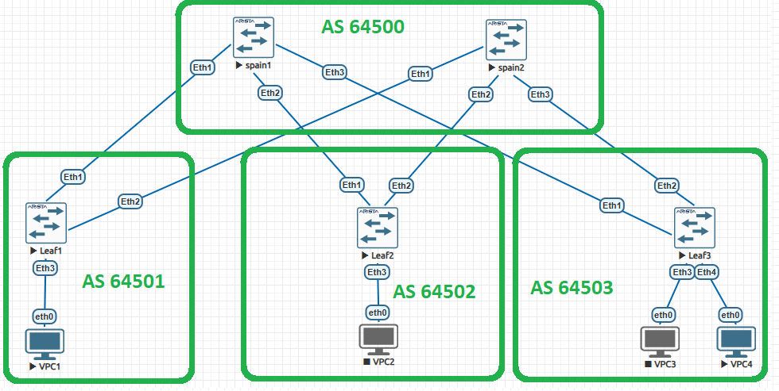

# Лабораторная работа: Настройка eBGP для Underlay сети дата-центра

---
1. Схема сети и адресное пространство
2. Конфигурация устройств (Arista EOS)
3. Подтверждение работоспособности и верификация (Логи фабрики)
4. Прохождение трафика между VPC1<->VPC4

## 1. Схема сети и адресное пространство

### Автономные системы (ASN)
Сеть построена по топологии Clos (Spine-Leaf). Каждый Leaf находится в своей AS.
* **Spine-слой (s1, s2):** AS 64500
* **Leaf-слой (l1):** AS 64501
* **Leaf-слой (l2):** AS 64502
* **Leaf-слой (l3):** AS 64503

### Инфраструктурные интерфейсы (Loopback0)
* **s1:** `10.255.0.1/32`
* **s2:** `10.255.0.2/32`
* **l1:** `10.255.1.1/32`
* **l2:** `10.255.1.2/32`
* **l3:** `10.255.1.3/32`

### Таблица линков фабрики (Underlay P2P)

| От устройства | Интерфейс | До устройства | Интерфейс | Подсеть линка | IP (От) | IP (До) |
| :--- | :--- | :--- | :--- | :--- | :--- | :--- |
| **s1 (Spine 1)** | Eth1 | **l1 (Leaf 1)** | Eth1 | `10.0.11.0/30` | `10.0.11.1` | `10.0.11.2` |
| **s1 (Spine 1)** | Eth2 | **l2 (Leaf 2)** | Eth1 | `10.0.12.0/30` | `10.0.12.1` | `10.0.12.2` |
| **s1 (Spine 1)** | Eth3 | **l3 (Leaf 3)** | Eth1 | `10.0.13.0/30` | `10.0.13.1` | `10.0.13.2` |
| **s2 (Spine 2)** | Eth1 | **l1 (Leaf 1)** | Eth2 | `10.0.21.0/30` | `10.0.21.1` | `10.0.21.2` |
| **s2 (Spine 2)** | Eth2 | **l2 (Leaf 2)** | Eth2 | `10.0.22.0/30` | `10.0.22.1` | `10.0.22.2` |
| **s2 (Spine 2)** | Eth3 | **l3 (Leaf 3)** | Eth2 | `10.0.23.0/30` | `10.0.23.1` | `10.0.23.2` |

---

## 2. Конфигурация устройств (Arista EOS)

### 2.1. Конфигурация Spine-1 (s1)
```text
hostname s1
!
ip routing
!
interface Loopback0
   ip address 10.255.0.1/32
!
interface Ethernet1
   no switchport
   ip address 10.0.11.1/30
!
interface Ethernet2
   no switchport
   ip address 10.0.12.1/30
!
interface Ethernet3
   no switchport
   ip address 10.0.13.1/30
!
router bgp 64500
   router-id 10.255.0.1
   maximum-paths 4
   network 10.255.0.1/32
   neighbor 10.0.11.2 remote-as 64501
   neighbor 10.0.12.2 remote-as 64502
   neighbor 10.0.13.2 remote-as 64503
```

### 2.2. Конфигурация Leaf-2 (l2)
```text
hostname l2
!
ip routing
!
interface Loopback0
   ip address 10.255.1.2/32
!
interface Ethernet1
   no switchport
   ip address 10.0.12.2/30
!
interface Ethernet2
   no switchport
   ip address 10.0.22.2/30
!
interface Ethernet3
   no switchport
   ip address 172.16.2.1/24
!
router bgp 64502
   router-id 10.255.1.2
   maximum-paths 4
   network 10.255.1.2/32
   network 172.16.2.0/24
   neighbor 10.0.12.1 remote-as 64500
   neighbor 10.0.22.1 remote-as 64500
```

---

## 3. Подтверждение работоспособности и верификация (Логи фабрики)

### 3.1. Верификация на Spine-слое (s1)
```text
localhost#show ip bgp summary
BGP summary information for VRF default
Router identifier 10.255.0.1, local AS number 64500
Neighbor Status Codes: m - Under maintenance
  Neighbor  V AS           MsgRcvd   MsgSent  InQ OutQ  Up/Down State   PfxRcd PfxAcc PfxAdv
  10.0.11.2 4 64501             69        66    0    0 00:45:13 Estab   2      2      6
  10.0.12.2 4 64502             64        60    0    0 00:44:43 Estab   2      2      6
  10.0.13.2 4 64503             60        61    0    0 00:44:15 Estab   3      3      5

localhost#show ip route
Gateway of last resort is not set

 C        10.0.11.0/30
           directly connected, Ethernet1
 C        10.0.12.0/30
           directly connected, Ethernet2
 C        10.0.13.0/30
           directly connected, Ethernet3
 C        10.255.0.1/32
           directly connected, Loopback0
 B E      10.255.1.1/32 [200/0]
           via 10.0.11.2, Ethernet1
 B E      10.255.1.2/32 [200/0]
           via 10.0.12.2, Ethernet2
 B E      10.255.1.3/32 [200/0]
           via 10.0.13.2, Ethernet3
 B E      172.16.1.0/24 [200/0]
           via 10.0.11.2, Ethernet1
 B E      172.16.2.0/24 [200/0]
           via 10.0.12.2, Ethernet2
 B E      172.16.3.0/24 [200/0]
           via 10.0.13.2, Ethernet3
 B E      172.16.4.0/24 [200/0]
           via 10.0.13.2, Ethernet3

localhost#show ip interface brief
Interface       IP Address         Status      Protocol          MTU    Owner
--------------- ------------------ ----------- ------------- ---------- -------
Ethernet1       10.0.11.1/30       up          up               1500
Ethernet2       10.0.12.1/30       up          up               1500
Ethernet3       10.0.13.1/30       up          up               1500
Loopback0       10.255.0.1/32      up          up              65535
Management1     unassigned         up          up               1500
```

### 3.2. Верификация на Spine-слое (s2)
```text
localhost(config)#show ip bgp summary
BGP summary information for VRF default
Router identifier 10.255.0.2, local AS number 64500
Neighbor Status Codes: m - Under maintenance
  Neighbor  V AS           MsgRcvd   MsgSent  InQ OutQ  Up/Down State   PfxRcd PfxAcc PfxAdv
  10.0.21.2 4 64501             70        68    0    0 00:49:12 Estab   2      2      6
  10.0.22.2 4 64502             63        64    0    0 00:48:43 Estab   2      2      6
  10.0.23.2 4 64503             65        65    0    0 00:48:14 Estab   3      3      5

localhost(config)#show ip route bgp
 B E      10.255.1.1/32 [200/0]
           via 10.0.21.2, Ethernet1
 B E      10.255.1.2/32 [200/0]
           via 10.0.22.2, Ethernet2
 B E      10.255.1.3/32 [200/0]
           via 10.0.23.2, Ethernet3
 B E      172.16.1.0/24 [200/0]
           via 10.0.21.2, Ethernet1
 B E      172.16.2.0/24 [200/0]
           via 10.0.22.2, Ethernet2
 B E      172.16.3.0/24 [200/0]
           via 10.0.23.2, Ethernet3
 B E      172.16.4.0/24 [200/0]
           via 10.0.23.2, Ethernet3

localhost(config)#show ip interface brief
Interface       IP Address         Status      Protocol          MTU    Owner
--------------- ------------------ ----------- ------------- ---------- -------
Ethernet1       10.0.21.1/30       up          up               1500
Ethernet2       10.0.22.1/30       up          up               1500
Ethernet3       10.0.23.1/30       up          up               1500
Loopback0       10.255.0.2/32      up          up              65535
Management1     unassigned         up          up               1500
```

### 3.3. Верификация на Leaf-слое (l1)
```text
BGP summary information for VRF default
Router identifier 10.255.1.1, local AS number 64501
Neighbor Status Codes: m - Under maintenance
  Neighbor  V AS           MsgRcvd   MsgSent  InQ OutQ  Up/Down State   PfxRcd PfxAcc PfxAdv
  10.0.11.1 4 64500             72        74    0    0 00:49:57 Estab   6      6      5
  10.0.21.1 4 64500             69        70    0    0 00:49:57 Estab   6      6      6

localhost(config)#show ip route bgp
 B E      10.255.0.1/32 [200/0]
           via 10.0.11.1, Ethernet1
 B E      10.255.0.2/32 [200/0]
           via 10.0.21.1, Ethernet2
 B E      10.255.1.2/32 [200/0]
           via 10.0.11.1, Ethernet1
           via 10.0.21.1, Ethernet2
 B E      10.255.1.3/32 [200/0]
           via 10.0.11.1, Ethernet1
           via 10.0.21.1, Ethernet2
 B E      172.16.2.0/24 [200/0]
           via 10.0.11.1, Ethernet1
           via 10.0.21.1, Ethernet2
 B E      172.16.3.0/24 [200/0]
           via 10.0.11.1, Ethernet1
           via 10.0.21.1, Ethernet2
 B E      172.16.4.0/24 [200/0]
           via 10.0.11.1, Ethernet1
           via 10.0.21.1, Ethernet2

localhost(config)#show ip interface brief
Interface       IP Address         Status      Protocol          MTU    Owner
--------------- ------------------ ----------- ------------- ---------- -------
Ethernet1       10.0.11.2/30       up          up               1500
Ethernet2       10.0.21.2/30       up          up               1500
Ethernet3       172.16.1.1/24      up          up               1500
Loopback0       10.255.1.1/32      up          up              65535
Management1     unassigned         up          up               1500
```

### 3.4. Верификация на Leaf-слое (l2)
```text
BGP summary information for VRF default
Router identifier 10.255.1.2, local AS number 64502
Neighbor Status Codes: m - Under maintenance
  Neighbor  V AS           MsgRcvd   MsgSent  InQ OutQ  Up/Down State   PfxRcd PfxAcc PfxAdv
  10.0.12.1 4 64500             67        71    0    0 00:50:18 Estab   6      6      5
  10.0.22.1 4 64500             66        64    0    0 00:50:18 Estab   6      6      6

localhost(config)#show ip route bgp
 B E      10.255.0.1/32 [200/0]
           via 10.0.12.1, Ethernet1
 B E      10.255.0.2/32 [200/0]
           via 10.0.22.1, Ethernet2
 B E      10.255.1.1/32 [200/0]
           via 10.0.12.1, Ethernet1
           via 10.0.22.1, Ethernet2
 B E      10.255.1.3/32 [200/0]
           via 10.0.12.1, Ethernet1
           via 10.0.22.1, Ethernet2
 B E      172.16.1.0/24 [200/0]
           via 10.0.12.1, Ethernet1
           via 10.0.22.1, Ethernet2
 B E      172.16.3.0/24 [200/0]
           via 10.0.12.1, Ethernet1
           via 10.0.22.1, Ethernet2
 B E      172.16.4.0/24 [200/0]
           via 10.0.12.1, Ethernet1
           via 10.0.22.1, Ethernet2

localhost(config)#show ip interface brief
Interface       IP Address         Status      Protocol          MTU    Owner
--------------- ------------------ ----------- ------------- ---------- -------
Ethernet1       10.0.12.2/30       up          up               1500
Ethernet2       10.0.22.2/30       up          up               1500
Ethernet3       172.16.2.1/24      up          up               1500
Loopback0       10.255.1.2/32      up          up              65535
Management1     unassigned         up          up               1500
```

### 3.5. Верификация на Leaf-слое (l3)
```text
BGP summary information for VRF default
Router identifier 10.255.1.3, local AS number 64503
Neighbor Status Codes: m - Under maintenance
  Neighbor  V AS           MsgRcvd   MsgSent  InQ OutQ  Up/Down State   PfxRcd PfxAcc PfxAdv
  10.0.13.1 4 64500             68        68    0    0 00:50:34 Estab   5      5      4
  10.0.23.1 4 64500             67        68    0    0 00:50:34 Estab   5      5      8

localhost(config)#show ip route bgp
 B E      10.255.0.1/32 [200/0]
           via 10.0.13.1, Ethernet1
 B E      10.255.0.2/32 [200/0]
           via 10.0.23.1, Ethernet2
 B E      10.255.1.1/32 [200/0]
           via 10.0.13.1, Ethernet1
           via 10.0.23.1, Ethernet2
 B E      10.255.1.2/32 [200/0]
           via 10.0.13.1, Ethernet1
           via 10.0.23.1, Ethernet2
 B E      172.16.1.0/24 [200/0]
           via 10.0.13.1, Ethernet1
           via 10.0.23.1, Ethernet2
 B E      172.16.2.0/24 [200/0]
           via 10.0.13.1, Ethernet1
           via 10.0.23.1, Ethernet2

localhost(config)#show ip interface brief
Interface       IP Address         Status      Protocol          MTU    Owner
--------------- ------------------ ----------- ------------- ---------- -------
Ethernet1       10.0.13.2/30       up          up               1500
Ethernet2       10.0.23.2/30       up          up               1500
Ethernet3       172.16.3.1/24      up          up               1500
Ethernet4       172.16.4.1/24      up          up               1500
Loopback0       10.255.1.3/32      up          up              65535
Management1     unassigned         up          up               1500
```

4. Прохождение трафика между VPC1<->VPC4
```text
VPCS> show

NAME   IP/MASK              GATEWAY                             GATEWAY
VPCS1  172.16.1.10/24       172.16.1.1
       fe80::250:79ff:fe66:6807/64

VPCS> ping 172.16.4.10

84 bytes from 172.16.4.10 icmp_seq=1 ttl=61 time=69.153 ms
84 bytes from 172.16.4.10 icmp_seq=2 ttl=61 time=43.772 ms
84 bytes from 172.16.4.10 icmp_seq=3 ttl=61 time=43.061 ms
84 bytes from 172.16.4.10 icmp_seq=4 ttl=61 time=28.212 ms
84 bytes from 172.16.4.10 icmp_seq=5 ttl=61 time=35.559 ms

```