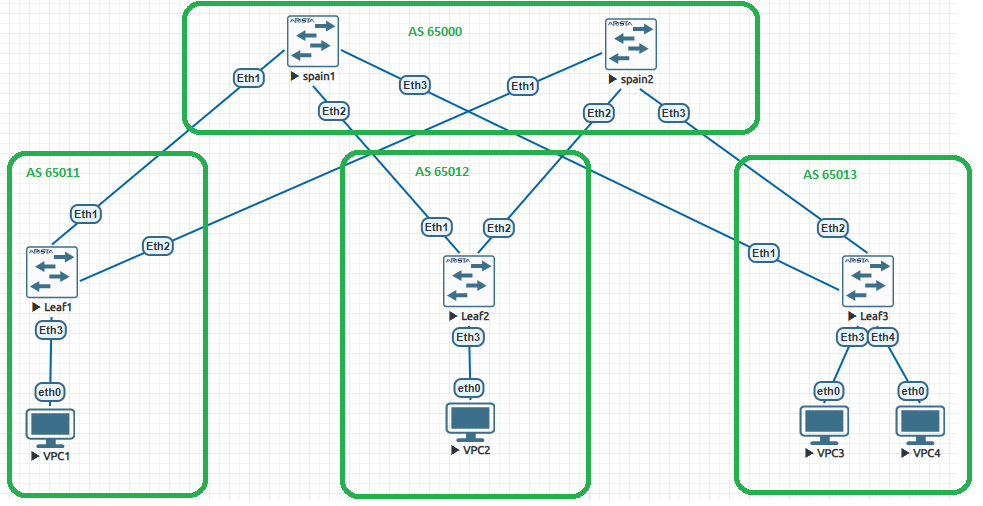

# Лабораторная работа: Настройка Overlay на основе VxLAN EVPN для L2 связанности (L2 VNI)

## 1. Цель работы
настроить Overlay на основе VxLAN EVPN для L2 связанности между клиентами.

---

## 2. Сетевой и адресный план

### Схема сети (Топология Clos)

PICTURE

### Таблица адресации Underlay (Физические стыки и Loopback)

| Устройство | Интерфейс | IP-адрес / Маска | Автономная система (AS) | Назначение |
| :--- | :--- | :--- | :--- | :--- |
| **Spine-1** | Loopback0 <br> Ethernet1 <br> Ethernet2 <br> Ethernet3 | 10.0.0.1/32 <br> 10.1.1.0/31 <br> 10.1.1.2/31 <br> 10.1.1.4/31 | AS 65000 | Router ID <br> Линк к Leaf-1 <br> Линк к Leaf-2 <br> Линк к Leaf-3 |
| **Spine-2** | Loopback0 <br> Ethernet1 <br> Ethernet2 <br> Ethernet3 | 10.0.0.2/32 <br> 10.1.1.6/31 <br> 10.1.1.8/31 <br> 10.1.1.10/31 | AS 65000 | Router ID <br> Линк к Leaf-1 <br> Линк к Leaf-2 <br> Линк к Leaf-3 |
| **Leaf-1** | Loopback0 <br> Ethernet1 <br> Ethernet2 | 10.0.0.11/32 <br> 10.1.1.1/31 <br> 10.1.1.7/31 | AS 65011 | VTEP Source / Router ID <br> Линк к Spine-1 <br> Линк к Spine-2 |
| **Leaf-2** | Loopback0 <br> Ethernet1 <br> Ethernet2 | 10.0.0.12/32 <br> 10.1.1.3/31 <br> 10.1.1.9/31 | AS 65012 | VTEP Source / Router ID <br> Линк к Spine-1 <br> Линк к Spine-2 |
| **Leaf-3** | Loopback0 <br> Ethernet1 <br> Ethernet2 | 10.0.0.13/32 <br> 10.1.1.5/31 <br> 10.1.1.11/31 | AS 65013 | VTEP Source / Router ID <br> Линк к Spine-1 <br> Линк к Spine-2 |

### Таблица Overlay (Клиентская LAN-зона)
*   **VLAN:** 10
*   **VNI (VXLAN ID):** 10010
*   **Клиентская подсеть:** 192.168.10.0/24
*   **Адреса хостов:** VPCS1 (`192.168.10.1`), VPCS2 (`192.168.10.2`), VPCS3 (`192.168.10.3`), VPCS4 (`192.168.10.4`)

---

## 3. Конфигурация устройств (Arista EOS)

### Глобальные настройки (Включение EVPN Multi-Agent на всех узлах)
```
service routing protocols model multi-agent
```

### 3.1. Настройки BGP & EVPN (Control Plane)
**Примечание по конфигурации:** В процессе отладки фабрики BGP EVPN VxLAN проводился поиск и экспериментальный подбор команд для устранения проблем. 
Итоговое состояние устройств не сбрасывалось «в ноль», поэтому представленные ниже листинги конфигураций являются эталонными (очищенными от промежуточных тестов) и полностью отражают целевую логику работающего стенда.
#### Пример конфигурации Spine-1 (s1)
```
router bgp 65000
   router-id 10.0.0.1
   neighbor LEAFS peer group
   neighbor LEAFS send-community extended
   neighbor 10.1.1.1 peer-group LEAFS
   neighbor 10.1.1.1 remote-as 65011
   neighbor 10.1.1.3 peer-group LEAFS
   neighbor 10.1.1.3 remote-as 65012
   neighbor 10.1.1.5 peer-group LEAFS
   neighbor 10.1.1.5 remote-as 65013
   !
   address-family evpn
      neighbor LEAFS activate
```

#### Пример конфигурации Leaf-2 (l2)
```
router bgp 65012
   router-id 10.0.0.12
   neighbor SPINES peer group
   neighbor SPINES remote-as 65000
   neighbor SPINES send-community extended
   neighbor SPINES allowas-in 1
   neighbor 10.1.1.2 peer-group SPINES
   neighbor 10.1.1.8 peer-group SPINES
   !
   address-family evpn
      neighbor SPINES activate
      neighbor SPINES allowas-in 1
   !
   vlan 10
      rd 10.0.0.12:10010
      route-target both 10010:10010
      redistribute learned
```

### 3.2. Настройки VXLAN & LAN (Data Plane / Клиентские порты)

#### Пример конфигурации интерфейсов на Leaf-2 (l2)
```
! Настройка клиентского LAN-порта (Доступ для хоста 192.168.10.2)
interface Ethernet3
   no shutdown
   switchport mode access
   switchport access vlan 10
!
! Настройка VXLAN-туннелирования и списков репликации BUM-трафика
interface Vxlan1
   vxlan source-interface Loopback0
   vxlan udp-port 4789
   vxlan vlan 10 vni 10010
   vxlan flood vtep 10.0.0.11 10.0.0.13
```

---

## 4. Проверка работоспособности (Verification)

### 4.1. Статус BGP сессий и Address Family EVPN (`show bgp evpn summary`)
Сессии со Spine-коммутаторами находятся в состоянии `Established`, происходит успешный обмен префиксами EVPN:
```text Leaf-1
localhost(config)#show bgp evpn summary
BGP summary information for VRF default
Router identifier 10.0.0.11, local AS number 65011
Neighbor Status Codes: m - Under maintenance
  Neighbor V AS           MsgRcvd   MsgSent  InQ OutQ  Up/Down State   PfxRcd PfxAcc PfxAdv
  10.1.1.0 4 65000            222       224    0    0 02:54:57 Estab   2      2      1
  10.1.1.6 4 65000            225       221    0    0 02:54:56 Estab   2      2      3
localhost(config)#
```

### 4.2. Таблица маршрутизации EVPN (`show bgp evpn`)
Коммутаторы успешно получают EVPN маршруты:
``` Leaf-1
localhost(config)#show bgp evpn
BGP routing table information for VRF default
Router identifier 10.0.0.11, local AS number 65011
Route status codes: * - valid, > - active, S - Stale, E - ECMP head, e - ECMP
                    c - Contributing to ECMP, % - Pending best path selection
Origin codes: i - IGP, e - EGP, ? - incomplete
AS Path Attributes: Or-ID - Originator ID, C-LST - Cluster List, LL Nexthop - Link Local Nexthop

          Network                Next Hop              Metric  LocPref Weight  Path
 * >      RD: 10.0.0.11:10010 imet 10.0.0.11
                                 -                     -       -       0       i
 * >Ec    RD: 10.0.0.12:10010 imet 10.0.0.12
                                 10.0.0.12             -       100     0       65000 65012 i
 *  ec    RD: 10.0.0.12:10010 imet 10.0.0.12
                                 10.0.0.12             -       100     0       65000 65012 i
 * >Ec    RD: 10.0.0.13:10010 imet 10.0.0.13
                                 10.0.0.13             -       100     0       65000 65013 i
 *  ec    RD: 10.0.0.13:10010 imet 10.0.0.13
                                 10.0.0.13             -       100     0       65000 65013 i

```

### 4.3. Состояние туннелей VXLAN (`show vxlan vtep` и `show vxlan vni`)
Маппинг VNI к VLAN активен, удаленные VTEP-интерфейсы Leaf-соседей успешно определены:
```text Leaf-3
localhost(config)#show vxlan vtep
Remote VTEPS for Vxlan1:

VTEP            Tunnel Type(s)
--------------- --------------
10.0.0.11       flood
10.0.0.12       flood

Total number of remote VTEPS:  2
localhost(config)#show vxlan vni
VNI to VLAN Mapping for Vxlan1
VNI         VLAN       Source       Interface       802.1Q Tag
----------- ---------- ------------ --------------- ----------
10010       10         static       Ethernet3       untagged
                                    Ethernet4       untagged
                                    Vxlan1          10

VNI to dynamic VLAN Mapping for Vxlan1
VNI       VLAN       VRF       Source
--------- ---------- --------- ------------
```

### 4.4. Таблицы MAC-адресов на Leaf-коммутаторах (`show mac address-table vlan 10`)

Демонстрация успешного динамического изучения MAC-адресов. Локальные хосты видны за физическими портами (`Et3`), а удаленные клиенты — за VXLAN-интерфейсом (`Vx1`).

**Пример таблицы MAC-адресов на Leaf-3:**
```text Leaf-3
localhost(config)#show mac address-table vlan 10
          Mac Address Table
------------------------------------------------------------------

Vlan    Mac Address       Type        Ports      Moves   Last Move
----    -----------       ----        -----      -----   ---------
  10    0050.7966.6807    DYNAMIC     Vx1        1       0:00:40 ago
  10    0050.7966.6808    DYNAMIC     Vx1        1       0:00:11 ago
  10    0050.7966.6809    DYNAMIC     Et3        1       0:00:20 ago
  10    0050.7966.680a    DYNAMIC     Et4        1       0:00:40 ago
Total Mac Addresses for this criterion: 4

          Multicast Mac Address Table
------------------------------------------------------------------

Vlan    Mac Address       Type        Ports
----    -----------       ----        -----
Total Mac Addresses for this criterion: 0

```

**Пример таблицы MAC-адресов на Leaf-2:**
```text Leaf-2
localhost(config)#show mac address-table vlan 10
          Mac Address Table
------------------------------------------------------------------

Vlan    Mac Address       Type        Ports      Moves   Last Move
----    -----------       ----        -----      -----   ---------
  10    0050.7966.6807    DYNAMIC     Vx1        1       0:02:30 ago
  10    0050.7966.6808    DYNAMIC     Et3        1       0:02:02 ago
  10    0050.7966.6809    DYNAMIC     Vx1        1       0:02:10 ago
  10    0050.7966.680a    DYNAMIC     Vx1        1       0:02:30 ago
Total Mac Addresses for this criterion: 4

          Multicast Mac Address Table
------------------------------------------------------------------

Vlan    Mac Address       Type        Ports
----    -----------       ----        -----
Total Mac Addresses for this criterion: 0

```

### 4.5. Доказательство сетевой связанности клиентов (Сквозной Ping)
Результат успешной передачи ICMP-пакетов между изолированными хостами через созданный Overlay:
```text VPCS1
VPCS> ping 192.168.10.1 -c 2

192.168.10.1 icmp_seq=1 ttl=64 time=0.001 ms
192.168.10.1 icmp_seq=2 ttl=64 time=0.001 ms

VPCS> ping 192.168.10.2 -c 2

84 bytes from 192.168.10.2 icmp_seq=1 ttl=64 time=64.400 ms
84 bytes from 192.168.10.2 icmp_seq=2 ttl=64 time=46.338 ms

VPCS> ping 192.168.10.3 -c 2

84 bytes from 192.168.10.3 icmp_seq=1 ttl=64 time=39.020 ms
84 bytes from 192.168.10.3 icmp_seq=2 ttl=64 time=52.877 ms

VPCS> ping 192.168.10.4 -c 2

84 bytes from 192.168.10.4 icmp_seq=1 ttl=64 time=36.756 ms
84 bytes from 192.168.10.4 icmp_seq=2 ttl=64 time=70.831 ms

VPCS>
```
