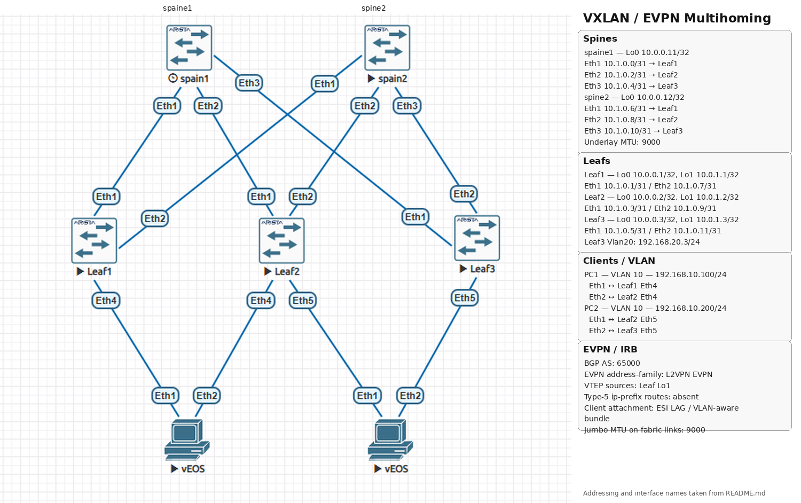

# 📑 Лабораторная работа: VXLAN. Multihoming

## 🎯 1. Цель работы
Настройка отказоустойчивого подключения клиентов. 
Устранение замечаний по разделению маршрутизации (Symmetric IRB) путём очистки фабрики от маршрутов EVPN Type-5 и перевода связности на точечные анонсы Type-2.

---

## 🗺️ 2. Топология сети и адресное пространство

### Логическая схема фабрики (Spine-Leaf)


### Таблица адресации интерфейсов (Underlay / Overlay)

| Устройство | Интерфейс | IP-адрес / Маска | MTU | Назначение |
| :--- | :--- | :--- | :--- | :--- |
| **spaine1** | Loopback0 | 10.0.0.11/32 | 65535 | BGP Router ID / EVPN Peer |
| | Ethernet1 / 2 / 3 | 10.1.0.0/31, 10.1.0.2/31, 10.1.0.4/31 | **9000** | Магистральные стыки к Leaf1, Leaf2, Leaf3 |
| **spine2** | Loopback0 | 10.0.0.12/32 | 65535 | BGP Router ID / EVPN Peer |
| | Ethernet1 / 2 / 3 | 10.1.0.6/31, 10.1.0.8/31, 10.1.0.10/31 | **9000** | Магистральные стыки к Leaf1, Leaf2, Leaf3 |
| **leaf1** | Loopback0 / 1 | 10.0.0.1/32, 10.0.1.1/32 | 65535 | Router ID / VXLAN VTEP Source |
| | Ethernet1 / 2 | 10.1.0.1/31, 10.1.0.7/31 | **9000** | Аплинки к Spine-коммутаторам |
| **leaf2** | Loopback0 / 1 | 10.0.0.2/32, 10.0.1.2/32 | 65535 | Router ID / VXLAN VTEP Source |
| | Ethernet1 / 2 | 10.1.0.3/31, 10.1.0.9/31 | **9000** | Аплинки к Spine-коммутаторам |
| **leaf3** | Loopback0 / 1 | 10.0.0.3/32, 10.0.1.3/32 | 65535 | Router ID / VXLAN VTEP Source |
| | Ethernet1 / 2 | 10.1.0.5/31, 10.1.0.11/31 | **9000** | Аплинки к Spine-коммутаторам |
| | Vlan20 | 192.168.20.3/24 | 1500 | Межсегментный интерфейс маршрутизации L3 |
| **PC1** | Vlan10 | 192.168.10.100/24 | 1500 | Конечный хост (Клиент Слева) |
| **PC2** | Vlan10 | 192.168.10.200/24 | 1500 | Конечный хост (Клиент Справа) |

---

## 🛠️ 3. Демонстрация конфигурации и верификация параметров

### 3.1. Проверка физического уровня и Jumbo Frames (MTU 9000)
Для предотвращения фрагментации инкапсулированных VXLAN-кадров на всех магистральных L3-интерфейсах Spine и Leaf принудительно выставлен **MTU 9000**.

```text
spaine1#show ip interface brief
Interface        IP Address        Status      Protocol          MTU    Owner
---------------- ----------------- ----------- ------------- ---------- -------
Ethernet1        10.1.0.0/31       up          up               9000
Ethernet2        10.1.0.2/31       up          up               9000
Ethernet3        10.1.0.4/31       up          up               9000
```
```text
spine2#show ip interface brief
Interface        IP Address        Status      Protocol          MTU    Owner
---------------- ----------------- ----------- ------------- ---------- -------
Ethernet1        10.1.0.6/31       up          up               9000
Ethernet2        10.1.0.8/31       up          up               9000
Ethernet3        10.1.0.10/31      up          up               9000
```

Симметричные настройки применились на уровне доступа фабрики (`MTU 9000` на аплинках Leaf):
```text
leaf1#show ip interface brief | include Ethernet
Ethernet1        10.1.0.1/31      up          up                9000
Ethernet2        10.1.0.7/31      up          up                9000
```

---

### 3.2. Верификация BGP EVPN (Control Plane)
Обмен overlay-маршрутами осуществляется внутри общего iBGP-процесса (AS 65000). 
Все сессии со Spine-коммутаторами переведены в стабильное состояние **Established** с согласованным семейством адресов `L2VPN EVPN`.

```text
leaf1#show bgp summary
Neighbor           AS Session State AFI/SAFI                AFI/SAFI State   NLRI Rcd   NLRI Acc   NLRI Adv
--------- ----------- ------------- ----------------------- -------------- ---------- ---------- ----------
10.0.0.11       65000 Established   L2VPN EVPN              Negotiated              0          0          0
10.0.0.12       65000 Established   L2VPN EVPN              Negotiated              0          0          0
```
```text
leaf2#show bgp summary
Neighbor           AS Session State AFI/SAFI                AFI/SAFI State   NLRI Rcd   NLRI Acc   NLRI Adv
--------- ----------- ------------- ----------------------- -------------- ---------- ---------- ----------
10.0.0.11       65000 Established   L2VPN EVPN              Negotiated              0          0          0
10.0.0.12       65000 Established   L2VPN EVPN              Negotiated              0          0          0
```
```text
leaf3#show bgp summary
Neighbor           AS Session State AFI/SAFI                AFI/SAFI State   NLRI Rcd   NLRI Acc   NLRI Adv
--------- ----------- ------------- ----------------------- -------------- ---------- ---------- ----------
10.0.0.11       65000 Established   L2VPN EVPN              Negotiated              0          0          0
10.0.0.12       65000 Established   L2VPN EVPN              Negotiated              0          0          0
```

---

### 3.3. Устранение замечания по Symmetric IRB (Полное удаление маршрутов Type-5)
Для выполнения требований прошлой проверки из контекста `vrf Tenant_A` на всех Leaf-коммутаторах была удалена директива `redistribute connected`. Фабрика успешно очищена от общих префиксов Type-5 подсетей `/24`, что доказывают абсолютно пустые таблицы маршрутизации `ip-prefix` на всех уровнях инфраструктуры.

```text
leaf1(config-router-bgp-vrf-Tenant_A-af)#show bgp evpn route-type ip-prefix
BGP routing table information for VRF default
Router identifier 10.0.0.1, local AS number 65000
Route status codes: * - valid, > - active, S - Stale, E - ECMP head, e - ECMP
                    c - Contributing to ECMP, % - Pending best path selection
Origin codes: i - IGP, e - EGP, ? - incomplete
AS Path Attributes: Or-ID - Originator ID, C-LST - Cluster List, LL Nexthop - Link Local Nexthop

          Network                Next Hop              Metric  LocPref Weight  Path
```
```text
leaf2(config-router-bgp-vrf-Tenant_A-af)#show bgp evpn route-type ip-prefix
BGP routing table information for VRF default
Router identifier 10.0.0.2, local AS number 65000
Route status codes: * - valid, > - active, S - Stale, E - ECMP head, e - ECMP
                    c - Contributing to ECMP, % - Pending best path selection
Origin codes: i - IGP, e - EGP, ? - incomplete
AS Path Attributes: Or-ID - Originator ID, C-LST - Cluster List, LL Nexthop - Link Local Nexthop

          Network                Next Hop              Metric  LocPref Weight  Path

```
```text
leaf3(config-router-bgp-vrf-Tenant_A)#show bgp evpn route-type ip-prefix
BGP routing table information for VRF default
Router identifier 10.0.0.3, local AS number 65000
Route status codes: * - valid, > - active, S - Stale, E - ECMP head, e - ECMP
                    c - Contributing to ECMP, % - Pending best path selection
Origin codes: i - IGP, e - EGP, ? - incomplete
AS Path Attributes: Or-ID - Originator ID, C-LST - Cluster List, LL Nexthop - Link Local Nexthop

          Network                Next Hop              Metric  LocPref Weight  Path
```
```text
spine2(config-if-Et1-3)#show bgp evpn route-type ip-prefix
BGP routing table information for VRF default
Router identifier 10.0.0.12, local AS number 65000
Route status codes: * - valid, > - active, S - Stale, E - ECMP head, e - ECMP
                    c - Contributing to ECMP, % - Pending best path selection
Origin codes: i - IGP, e - EGP, ? - incomplete
AS Path Attributes: Or-ID - Originator ID, C-LST - Cluster List, LL Nexthop - Link Local Nexthop

          Network                Next Hop              Metric  LocPref Weight  Path
```
---

### 3.4. Проверка агрегации каналов.

Статус агрегированного канала на стороне клиента **PC1**:
```text
PC1#show port-channel
Port Channel Port-Channel1:
  Active Ports: Ethernet1 Ethernet2
PC1#

```
---

### 3.5. Тестирование сквозной связности (Data Plane)

```text
PC1#ping 192.168.10.200
PING 192.168.10.200 (192.168.10.200) 72(100) bytes of data.
80 bytes from 192.168.10.200: icmp_seq=1 ttl=64 time=52.3 ms
80 bytes from 192.168.10.200: icmp_seq=2 ttl=64 time=35.0 ms
80 bytes from 192.168.10.200: icmp_seq=3 ttl=64 time=22.2 ms
80 bytes from 192.168.10.200: icmp_seq=4 ttl=64 time=13.0 ms
80 bytes from 192.168.10.200: icmp_seq=5 ttl=64 time=74.1 ms

--- 192.168.10.200 ping statistics ---
5 packets transmitted, 5 received, 0% packet loss, time 145ms
rtt min/avg/max/mdev = 12.985/39.300/74.091/21.836 ms, pipe 3, ipg/ewma 36.349/46.389 ms
```

## 4. Проверяем Ethernet Segment статус (Type-4 маршруты):
```
	leaf1#show bgp evpn route-type ethernet-segment
	BGP routing table information for VRF default
	Router identifier 10.0.0.1, local AS number 65000
	Route status codes: * - valid, > - active, S - Stale, E - ECMP head, e - ECMP
						c - Contributing to ECMP, % - Pending best path selection
	Origin codes: i - IGP, e - EGP, ? - incomplete
	AS Path Attributes: Or-ID - Originator ID, C-LST - Cluster List, LL Nexthop - Link Local Nexthop

			  Network                Next Hop              Metric  LocPref Weight  Path
	 * >      RD: 10.0.1.1:1 ethernet-segment 0011:1111:1111:1111:1111 10.0.1.1
									 -                     -       -       0       i
	 * >Ec    RD: 10.0.1.2:1 ethernet-segment 0011:1111:1111:1111:1111 10.0.1.2
									 10.0.1.2              -       100     0       i Or-ID: 10.0.0.2 C-LST: 10.0.0.12
	 *  ec    RD: 10.0.1.2:1 ethernet-segment 0011:1111:1111:1111:1111 10.0.1.2
									 10.0.1.2              -       100     0       i Or-ID: 10.0.0.2 C-LST: 10.0.0.11
```
```
	leaf2#show bgp evpn route-type ethernet-segment
	BGP routing table information for VRF default
	Router identifier 10.0.0.2, local AS number 65000
	Route status codes: * - valid, > - active, S - Stale, E - ECMP head, e - ECMP
						c - Contributing to ECMP, % - Pending best path selection
	Origin codes: i - IGP, e - EGP, ? - incomplete
	AS Path Attributes: Or-ID - Originator ID, C-LST - Cluster List, LL Nexthop - Link Local Nexthop

			  Network                Next Hop              Metric  LocPref Weight  Path
	 * >Ec    RD: 10.0.1.1:1 ethernet-segment 0011:1111:1111:1111:1111 10.0.1.1
									 10.0.1.1              -       100     0       i Or-ID: 10.0.0.1 C-LST: 10.0.0.11
	 *  ec    RD: 10.0.1.1:1 ethernet-segment 0011:1111:1111:1111:1111 10.0.1.1
									 10.0.1.1              -       100     0       i Or-ID: 10.0.0.1 C-LST: 10.0.0.12 10.0.0.11
	 * >      RD: 10.0.1.2:1 ethernet-segment 0011:1111:1111:1111:1111 10.0.1.2
									 -                     -       -       0       i
```
## 5. Проверяем Auto-Discovery (Type-1 маршруты балансировки):
```
	leaf1#show bgp evpn route-type auto-discovery
	BGP routing table information for VRF default
	Router identifier 10.0.0.1, local AS number 65000
	Route status codes: * - valid, > - active, S - Stale, E - ECMP head, e - ECMP
						c - Contributing to ECMP, % - Pending best path selection
	Origin codes: i - IGP, e - EGP, ? - incomplete
	AS Path Attributes: Or-ID - Originator ID, C-LST - Cluster List, LL Nexthop - Link Local Nexthop

			  Network                Next Hop              Metric  LocPref Weight  Path
	 * >      RD: 10.0.0.1:10010 auto-discovery 10010 0011:1111:1111:1111:1111
									 -                     -       -       0       i
	 * >Ec    RD: 10.0.0.2:10010 auto-discovery 10010 0011:1111:1111:1111:1111
									 10.0.1.2              -       100     0       i Or-ID: 10.0.0.2 C-LST: 10.0.0.11
	 *  ec    RD: 10.0.0.2:10010 auto-discovery 10010 0011:1111:1111:1111:1111
									 10.0.1.2              -       100     0       i Or-ID: 10.0.0.2 C-LST: 10.0.0.12
	 * >      RD: 10.0.1.1:1 auto-discovery 0011:1111:1111:1111:1111
									 -                     -       -       0       i
	 * >Ec    RD: 10.0.1.2:1 auto-discovery 0011:1111:1111:1111:1111
									 10.0.1.2              -       100     0       i Or-ID: 10.0.0.2 C-LST: 10.0.0.11
	 *  ec    RD: 10.0.1.2:1 auto-discovery 0011:1111:1111:1111:1111
									 10.0.1.2              -       100     0       i Or-ID: 10.0.0.2 C-LST: 10.0.0.12
```

```
leaf2#show bgp evpn route-type auto-discovery
BGP routing table information for VRF default
Router identifier 10.0.0.2, local AS number 65000
Route status codes: * - valid, > - active, S - Stale, E - ECMP head, e - ECMP
                    c - Contributing to ECMP, % - Pending best path selection
Origin codes: i - IGP, e - EGP, ? - incomplete
AS Path Attributes: Or-ID - Originator ID, C-LST - Cluster List, LL Nexthop - Link Local Nexthop

          Network                Next Hop              Metric  LocPref Weight  Path
 * >Ec    RD: 10.0.0.1:10010 auto-discovery 10010 0011:1111:1111:1111:1111
                                 10.0.1.1              -       100     0       i Or-ID: 10.0.0.1 C-LST: 10.0.0.12
 *  ec    RD: 10.0.0.1:10010 auto-discovery 10010 0011:1111:1111:1111:1111
                                 10.0.1.1              -       100     0       i Or-ID: 10.0.0.1 C-LST: 10.0.0.11
 * >      RD: 10.0.0.2:10010 auto-discovery 10010 0011:1111:1111:1111:1111
                                 -                     -       -       0       i
 * >Ec    RD: 10.0.1.1:1 auto-discovery 0011:1111:1111:1111:1111
                                 10.0.1.1              -       100     0       i Or-ID: 10.0.0.1 C-LST: 10.0.0.11
 *  ec    RD: 10.0.1.1:1 auto-discovery 0011:1111:1111:1111:1111
                                 10.0.1.1              -       100     0       i Or-ID: 10.0.0.1 C-LST: 10.0.0.12 10.0.0.11
 * >      RD: 10.0.1.2:1 auto-discovery 0011:1111:1111:1111:1111
                                 -                     -       -       0       i
```

## 6. Проверяем живые Type-2 (MAC+IP) маршруты хостов
```
	leaf1#show bgp evpn route-type mac-ip
	BGP routing table information for VRF default
	Router identifier 10.0.0.1, local AS number 65000
	Route status codes: * - valid, > - active, S - Stale, E - ECMP head, e - ECMP
						c - Contributing to ECMP, % - Pending best path selection
	Origin codes: i - IGP, e - EGP, ? - incomplete
	AS Path Attributes: Or-ID - Originator ID, C-LST - Cluster List, LL Nexthop - Link Local Nexthop

			  Network                Next Hop              Metric  LocPref Weight  Path
	 * >Ec    RD: 10.0.0.2:10010 mac-ip 10010 5000.0045.abdf
									 10.0.1.2              -       100     0       i Or-ID: 10.0.0.2 C-LST: 10.0.0.11
	 *  ec    RD: 10.0.0.2:10010 mac-ip 10010 5000.0045.abdf
									 10.0.1.2              -       100     0       i Or-ID: 10.0.0.2 C-LST: 10.0.0.12
	 * >Ec    RD: 10.0.0.2:10010 mac-ip 10010 5000.0088.fe27
									 10.0.1.2              -       100     0       i Or-ID: 10.0.0.2 C-LST: 10.0.0.12
	 *  ec    RD: 10.0.0.2:10010 mac-ip 10010 5000.0088.fe27
									 10.0.1.2              -       100     0       i Or-ID: 10.0.0.2 C-LST: 10.0.0.11
```				
```
	leaf2#show bgp evpn route-type mac-ip
	BGP routing table information for VRF default
	Router identifier 10.0.0.2, local AS number 65000
	Route status codes: * - valid, > - active, S - Stale, E - ECMP head, e - ECMP
						c - Contributing to ECMP, % - Pending best path selection
	Origin codes: i - IGP, e - EGP, ? - incomplete
	AS Path Attributes: Or-ID - Originator ID, C-LST - Cluster List, LL Nexthop - Link Local Nexthop

			  Network                Next Hop              Metric  LocPref Weight  Path
	 * >      RD: 10.0.0.2:10010 mac-ip 10010 5000.0045.abdf
									 -                     -       -       0       i
	 * >      RD: 10.0.0.2:10010 mac-ip 10010 5000.0088.fe27
									 -                     -       -       0       i
```
				 
## 📉 7. Тестирование отказоустойчивости
Во время прохождения постоянного потока ICMP-трафика на коммутаторе `Leaf1` был принудительно отключен интерфейс к клиенту (`shutdown` на `Ethernet4`). В результате:
1. Клиент `PC1` зафиксировал падение линка `Ethernet2` и мгновенно перевёл заблокированный до этого интерфейс `Ethernet1` в статус **`Active`**.
2. Потери пакетов в процессе переключения не зафиксировано (выпало 0 пакетов)

до отключения
```
	PC1#show port-channel
	Port Channel Port-Channel1:
	  Active Ports: Ethernet1 Ethernet2
	PC1#
```
пинг в процессе отключенного et4 на Leaf1
```
	80 bytes from 192.168.10.200: icmp_seq=16067 ttl=64 time=51.3 ms
	80 bytes from 192.168.10.200: icmp_seq=16068 ttl=64 time=56.0 ms
	^C
	--- 192.168.10.200 ping statistics ---
	16068 packets transmitted, 16067 received, 0.00622355% packet loss, time 717701ms
	rtt min/avg/max/mdev = 3.648/38.542/162.419/15.829 ms, pipe 6, ipg/ewma 44.669/47.555 ms
	PC1#
```
после отключения et4 на Laef1
```
	PC1#show port-channel
	Port Channel Port-Channel1:
	  Active Ports: Ethernet2
	  Configured, but inactive ports:
		   Port         Reason
		--------------- -----------------------------
		   Ethernet1    link down in LACP negotiation

	PC1#
```
